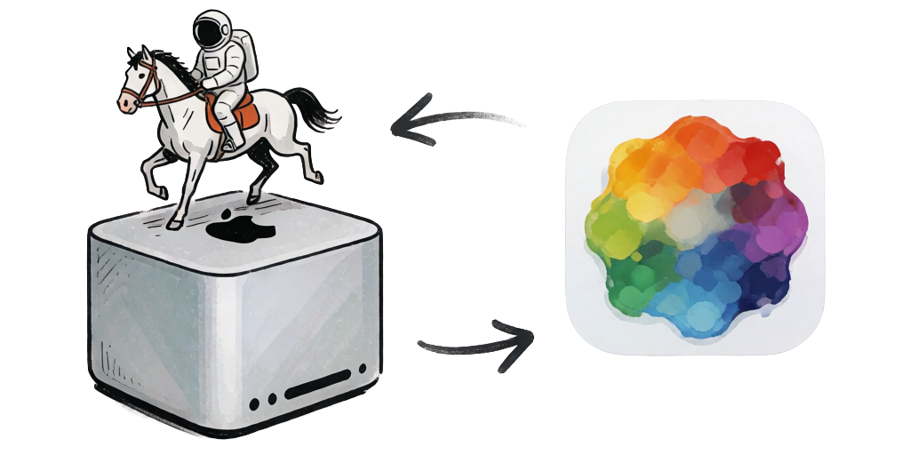

<p align="center">
  
</p>

# DrawThingsClient

A Swift client for the [Draw Things](https://drawthings.ai) gRPC server, for macOS and iOS apps.

DrawThingsClient speaks the Draw Things gRPC protocol directly. It handles the transport, encodes and decodes Draw Things' tensor image format, serializes configurations, resolves model specifications, and streams progress, previews, images and audio as they are generated. You work with `CGImage`, `NSImage`/`UIImage` and plain Swift types; text-to-image, image-to-image, inpainting, ControlNet, LoRA, video and audio generation are each one async call.

> **Upgrading from 1.x?** Version 2 is a major rework. See [MIGRATING-2.0.md](MIGRATING-2.0.md) and the [CHANGELOG](CHANGELOG.md).

## Features

- **Swift 6 concurrency**: `Sendable` value types, an actor-based service and an `AsyncThrowingStream` of generation events delivered in server order.
- **SwiftUI**: an `@Observable` `DrawThingsSession` (in the `DrawThingsClientUI` product) whose progress and preview update your views.
- **Cancellation**: cancelling the task (or leaving the event loop) cancels the generation on the server.
- **Video and audio**: frames, generated audio (`GeneratedAudio`, with WAV export) and each model's frame rate and audio sample rate.
- **Draw Things JSON**: read and write the app's configuration JSON, including its "Copy Configuration" output.
- **Model specifications**: the specs servers need for newer models come from the server, a snapshot bundled with the package, or (opt-in) the live Draw Things list; no network request by default.
- **Safe with untrusted data**: tensor headers, compressed payloads and configuration values are validated; bad data throws instead of crashing.
- **TLS**: verifies public servers and accepts the self-signed certificates Draw Things uses on local networks.

## Requirements

- macOS 15 / iOS 18
- Swift 6 (Xcode 16 or later)
- A Draw Things gRPC server: the Draw Things app with its API server enabled, or the standalone `gRPCServerCLI`

### Draw Things server settings

| Setting | Supported | Notes |
|---|---|---|
| Response compression | On or off | The client decompresses responses. |
| Transport Layer Security | On or off | Match `ConnectionOptions.security` to the server. TLS is recommended. |
| Bridge Mode (e.g. Draw Things+) | On or off | Generation passes through to the bridged server. Some models only run locally, and DT+ Bring Your Own LoRA isn't supported through a bridge (a DT+ limitation). |
| Enable Model Browsing | On or off | When on, the server reports its installed models and their specs; when off, the client uses its bundled specs. Model browsing is needed to list a server's models in a UI. |
| Shared Secret | On or off | Set `ConnectionOptions.sharedSecret`. |

## Installation

```swift
dependencies: [
    .package(url: "https://github.com/euphoriacyberware-ai/DT-gRPC-Swift-Client", from: "2.0.0")
]
```

Then add the products you need to your target:

```swift
.product(name: "DrawThingsClient", package: "DT-gRPC-Swift-Client"),    // core
.product(name: "DrawThingsClientUI", package: "DT-gRPC-Swift-Client"),  // SwiftUI session (optional)
```

| Product | Contents |
|---|---|
| `DrawThingsClient` | `DrawThingsService`, configuration and JSON, tensors and image helpers, media types, logging. No SwiftUI or Combine. |
| `DrawThingsClientUI` | `DrawThingsSession`, an `@Observable` wrapper for SwiftUI. |

**DrawThings family:** this is the base library that [DrawThingsQueue](https://github.com/euphoriacyberware-ai/DrawThingsQueue), [DrawThingsKit](https://github.com/euphoriacyberware-ai/DrawThingsKit) and [DrawThingsVideoKit](https://github.com/euphoriacyberware-ai/DrawThingsVideoKit) build on.

**Third-party packages** (resolved by Swift Package Manager): [grpc-swift-2](https://github.com/grpc/grpc-swift-2), [grpc-swift-nio-transport](https://github.com/grpc/grpc-swift-nio-transport), [grpc-swift-protobuf](https://github.com/grpc/grpc-swift-protobuf), [swift-protobuf](https://github.com/apple/swift-protobuf) and [flatbuffers](https://github.com/google/flatbuffers). fpzip (floating-point tensor decompression) is bundled as the `CFpzip` target.

## Quick start

### SwiftUI

```swift
import SwiftUI
import DrawThingsClient
import DrawThingsClientUI

struct ContentView: View {
    @State private var session = try! DrawThingsSession(address: "localhost:7859")
    @State private var image: CGImage?

    var body: some View {
        VStack {
            if let progress = session.progress {
                Text(progress.stage.description)
                ProgressView(value: progress.fractionCompleted ?? 0)
            }
            if let preview = session.preview ?? image {
                Image(decorative: preview, scale: 1).resizable().scaledToFit()
            }
            Button("Generate") {
                Task {
                    let result = try await session.generate(GenerationRequest(
                        prompt: "A lighthouse on a rocky coast at sunset",
                        configuration: DrawThingsConfiguration(
                            width: 1024, height: 1024, steps: 8,
                            model: "z_image_turbo_1.0_q8p.ckpt",
                            sampler: .dpmpp2mtrailing, guidanceScale: 1, shift: 3
                        )
                    ))
                    image = result.images.first
                }
            }
            .disabled(!session.isConnected || session.isGenerating)
        }
        .task { await session.connect() }
    }
}
```

`DrawThingsSession` exposes `isConnected`, `serverInfo`, `isGenerating`, `progress`, `preview`, `remoteDownload`, `lastResult` and `lastError`, plus `cancel()`. It runs one generation at a time; `generate` throws `SessionError.busy` if another is running. A complete app is in [Examples/SwiftUIExample](Examples/SwiftUIExample).

### Without SwiftUI

```swift
import DrawThingsClient

let service = try DrawThingsService(address: "localhost:7859")

// Stream events as they arrive...
let request = GenerationRequest(prompt: "A red fox in fresh snow", configuration: configuration)
for try await event in service.stream(request) {
    switch event {
    case .progress(let progress): print(progress.stage)
    case .preview(let preview): show(preview)                // CGImage
    case .remoteDownload(let download): print(download.fractionCompleted ?? 0)
    case .image(let image, let index): save(image, index)    // each final image as it arrives
    case .audio(let audio): play(audio)                      // GeneratedAudio
    case .completed(let result): print(result.duration)      // always last
    }
}

// ...or just wait for the result.
let result = try await service.generate(request)
let images: [CGImage] = result.images           // or result.platformImages

await service.shutdown()
```

Events arrive in the order the server sends them. Cancelling the task that consumes the stream, or breaking out of the loop, cancels the generation on the server; `generate(_:)` then throws `CancellationError`.

## Connecting

```swift
// host:port, bare host (port 7859), [IPv6]:port or a bare IPv6 address
let endpoint = try ServerEndpoint("192.168.1.20:7859")

let service = DrawThingsService(endpoint: endpoint, options: ConnectionOptions(
    security: .tls(),                 // or .plaintext; must match the server
    sharedSecret: "my-secret",        // when the server requires one
    clientIdentity: ClientIdentity(user: "My App", device: .laptop),
    requestTimeout: .seconds(30),     // unary calls; generations are not limited
    modelSpecs: .bundled              // or .bundledAndRemote() to use the live model list
))

let reply = try await service.echo()  // checks the connection; reply.files lists installed models
```

No network activity happens until the first call. Call `shutdown()` when you are done with a service.

### TLS certificate verification

Draw Things serves a self-signed certificate. With the default `.tls(verification: .automatic)`, the client skips verification for **local-network** hosts (loopback, private and link-local addresses, `.local` names, single-label names, and host names that resolve only to such addresses) and verifies public hosts fully against the system trust store.

| Verification | Use |
|---|---|
| `.automatic` (default) | Local servers work out of the box; public servers are verified. |
| `.full` | Always verify against the system trust store. |
| `.trustRoots([pem])` | Verify a self-signed server reached over the internet by its certificate. |
| `.none` | Never verify (encrypted but open to interception). |

A TLS/plaintext mismatch or a rejected certificate surfaces as `DrawThingsError.connectionFailed` with a hint.

## Requests

```swift
var configuration = DrawThingsConfiguration(
    width: 1024, height: 1024, steps: 8,
    model: "z_image_turbo_1.0_q8p.ckpt",
    sampler: .dpmpp2mtrailing,
    guidanceScale: 1,
    seed: 12345,          // nil = random
    shift: 3
)

let request = GenerationRequest(
    prompt: "A watercolor of a harbor",
    negativePrompt: "blurry",
    configuration: configuration,
    image: inputImage,    // CGImage: image-to-image / inpainting canvas
    mask: maskImage,      // CGImage: transparent pixels are regenerated
    hints: try hints.build()
)
```

Sizes are in pixels and are sent to the server in units of 64, rounded down. `validate()` reports values the server can't accept (and `toFlatBufferData()` calls it), so a bad configuration throws `DrawThingsError.invalidConfiguration(field:reason:)` instead of crashing. Image inputs are `CGImage`; for `NSImage`/`UIImage` use `image.cgImageRepresentation`, which also applies `UIImage` orientation, or `DrawThingsSession.generate(prompt:configuration:image:mask:)`.

### Image to image and inpainting

```swift
var configuration = DrawThingsConfiguration(width: 768, height: 768, steps: 8, model: "z_image_turbo_1.0_q8p.ckpt", strength: 0.6)
let request = GenerationRequest(prompt: "A red fox, watercolor", configuration: configuration, image: photo)

// Inpainting: pass a mask whose transparent pixels mark the area to regenerate.
configuration.strength = 1
let inpaint = GenerationRequest(prompt: "A cat on the bench", configuration: configuration, image: photo, mask: mask)
```

The client encodes the canvas as an RGB tensor and the mask as Draw Things' 1-byte mask tensor (an RGB tensor sent as a mask crashes the server). Set `enableInpainting` for models that need the inpaint control.

### LoRAs

```swift
configuration.loras = [
    LoRAConfig(file: "style_lora_f16.ckpt", weight: 0.8),              // mode: .all
    LoRAConfig(file: "refiner_detail_lora_f16.ckpt", weight: 0.5, mode: .refiner),
]
```

The client sends a specification for each LoRA. A LoRA with no known spec gets a minimal one using the model's version, because the server silently skips LoRAs it has no spec for.

### Hints, moodboard and ControlNet

```swift
var hints = HintBuilder()
hints.addMoodboardImage(referencePNG)              // "shuffle"
hints.addDepthMap(depthPNG, weight: 0.8)
hints.addHint(type: .tile, imageData: tileJPEG)
let request = GenerationRequest(prompt: "...", configuration: configuration, hints: try hints.build())
```

`HintBuilder` takes encoded images (PNG, JPEG, HEIC...), applies EXIF orientation, and throws `HintBuildError` for an image it can't decode instead of dropping it. Hint types keep the order they were first added.

| Method | Hint type |
|---|---|
| `addMoodboardImage(_:weight:)`, `addMoodboardImages(_:weight:)` | `shuffle` |
| `addDepthMap(_:weight:)` | `depth` |
| `addPose(_:weight:)` | `pose` |
| `addCannyEdges(_:weight:)` | `canny` |
| `addScribble(_:weight:)` | `scribble` |
| `addColorReference(_:weight:)` | `color` |
| `addLineArt(_:weight:)` | `lineart` |
| `addHint(type:imageData:weight:)` | any `HintType` or string |

ControlNet models are configured as controls; their input images are sent as hints:

```swift
configuration.controls = [
    ControlConfig(file: "controlnet_depth_sdxl_f16.ckpt", weight: 0.8, guidanceEnd: 0.7, controlMode: .control),
]
```

`ControlConfig` carries every Draw Things control setting: `weight`, `guidanceStart`/`guidanceEnd`, `controlMode` (`.balanced`, `.prompt`, `.control`), `globalAveragePooling` (true only for Shuffle), `noPrompt`, `downSamplingRate`, `inputOverride` and `targetBlocks`.

### Video and audio

```swift
let configuration = DrawThingsConfiguration(width: 576, height: 384, steps: 4, model: "minimax_h3_fl2va_q8p.ckpt", numFrames: 49)
let result = try await service.generate(GenerationRequest(prompt: "Waves on a beach, gulls calling", configuration: configuration))

result.media.isVideo          // true
result.media.frameRate        // 24
result.images                 // the frames, in order
if let audio = result.audio.first {
    try audio.wavData().write(to: wavURL)   // 32-bit float WAV, 32 kHz for MiniMax H3
    let buffer = try audio.pcmBuffer()      // AVAudioPCMBuffer
}
```

`MediaProfile` (on the request and the result) gives the model family, whether the output is a video, its native frame rate and the audio sample rate. Generated audio has no rate metadata, so the rate comes from the model; override it with `GenerationRequest.audioSampleRate` (and the family with `modelFamily`) for custom models.

## Draw Things configuration JSON

`DrawThingsConfiguration` is `Codable` in Draw Things' own JSON format, the format you paste into and copy from the app.

```swift
let configuration = try DrawThingsConfiguration.fromJSON(json)
let json = try configuration.toJSON()                 // pretty-printed, sorted keys
let json = try configuration.toJSON(includeSeed: false)  // seed -1 (random)

let result = DrawThingsConfiguration.validateJSON(text)  // isValid, error, configuration
let pretty = DrawThingsConfiguration.formatJSON(text)
```

The app produces the format in two shapes:

- **Copy Configuration** writes a compact subset: the settings relevant to the current model. Pasting it into the app changes only those settings, so it's an overlay. To apply it the same way, merge it onto a base configuration:

  ```swift
  var configuration = myDefaults
  try configuration.mergeJSON(copiedJSON)   // only keys present in the JSON change
  ```

- **Complete exports** (such as GetConfigPro) contain every key. `toJSON()` writes this shape, so its output reproduces the whole configuration when pasted into Draw Things.

`fromJSON` accepts both shapes: missing keys take `DrawThingsConfiguration`'s defaults. Example exports of both shapes are in [DT Config Examples](DT%20Config%20Examples).

Values in the JSON:

| Field | JSON | Swift |
|---|---|---|
| `width`, `height`, tile and hires-fix sizes | pixels | `Int32` pixels |
| `seed` | integer, `-1` = random | `UInt32?`, `nil` = random |
| `sampler`, `seedMode` | integer | `SamplerType`, `SeedMode` |
| `loras[].mode` | `"all"`, `"base"`, `"refiner"` | `LoRAMode` |
| `controls[].controlImportance` | `"balanced"`, `"prompt"`, `"control"` | `ControlMode` |
| `controls[].inputOverride` | `""`, `"depth"`, `"inpaint"`... | `ControlInputType` |
| `compressionArtifacts` | `"disabled"`, `"h264"`, `"h265"`, `"jpeg"` | `CompressionMethod` |
| `colorCalibration` | `"none"` (older exports: `"disabled"`), `"lab"` | `ColorCalibration` |
| `upscaler`, `faceRestoration`, `refinerModel` | `""` or `null` = none | `String?` |
| `causalInference` | `0` = off | `causalInferenceEnabled` + `causalInference` |

<details>
<summary>Sampler values</summary>

| Sampler | Value | Sampler | Value |
|---|---|---|---|
| `dpmpp2mkarras` | 0 | `dpmpp2mays` | 12 |
| `eulera` | 1 | `euleraays` | 13 |
| `ddim` | 2 | `dpmppsdeays` | 14 |
| `plms` | 3 | `dpmpp2mtrailing` | 15 |
| `dpmppsdekarras` | 4 | `ddimtrailing` | 16 |
| `unipc` | 5 | `unipctrailing` | 17 |
| `lcm` | 6 | `unipcays` | 18 |
| `eulerasubstep` | 7 | `tcdtrailing` | 19 |
| `dpmppsdesubstep` | 8 | | |
| `tcd` | 9 | | |
| `euleratrailing` | 10 | | |
| `dpmppsdetrailing` | 11 | | |

</details>

## Model specifications

A Draw Things server needs each request's model specification (version, latent space, objective...) to run models it doesn't have built in; without one it falls back to SD 1.x defaults and produces noise. The client resolves specs in this order:

1. specs your app registers: `await service.modelSpecs.register([ModelSpec(json:)...])`
2. the live Draw Things model list, only with `ConnectionOptions(modelSpecs: .bundledAndRemote())`
3. the snapshot bundled with this package, refreshed before each release (`Scripts/update-model-specs.sh`, run weekly by CI)
4. the specs the server reports in its echo reply (none when model browsing is off)

Built-in models, including quantized variants such as `_q8p`, are known to every server. Pass `GenerationRequest.override` to send your own `MetadataOverride` instead.

## Images and tensors

Draw Things exchanges images as tensors (a 68-byte header followed by Float16 values), not PNG or JPEG. `DrawThingsService` converts for you; `ImageHelpers` exposes the conversions for custom use:

```swift
let tensor = try ImageHelpers.imageToDTTensor(cgImage, forceRGB: true)
let image = try ImageHelpers.dtTensorToCGImage(tensor, modelFamily: .flux)   // previews need the family
let mask = try ImageHelpers.createMaskFromAlpha(maskImage)                   // Draw Things mask format

let upright = try ImageHelpers.loadCGImage(from: url)                        // applies EXIF orientation
try ImageHelpers.saveImage(image, to: outputURL, format: .png)
let resized = ImageHelpers.resizedImage(image, width: 1024, height: 768)     // exact pixels
let fitted = ImageHelpers.scaledImageToCanvas(image, canvasWidth: 1024, canvasHeight: 1024, backgroundColor: nil)
```

Every helper has a `CGImage` form (exact pixels, `Sendable`) and a `PlatformImage` (`NSImage`/`UIImage`) form. Results are rendered at one pixel per point, so sizes don't depend on the screen's scale.

### Model families

Previews are latents whose colors depend on the model architecture. The client picks the family from the model file name (`ModelFamily.detect(from:)`); override it with `GenerationRequest.modelFamily`.

| Family | Models | Latent channels | Native FPS | Audio |
|---|---|---|---|---|
| `.sd1` | SD 1.x, SD 2.x, SVD | 4 | | |
| `.sdxl` | SDXL, SSD-1B, PixArt, AuraFlow | 4 | | |
| `.sd3` | Stable Diffusion 3 | 16 | | |
| `.flux` | Flux.1, HiDream-I1, SeedVR2 | 16 | | |
| `.flux2` | Flux.2, Ernie Image, Ideogram 4 | 32 | | |
| `.qwen` | Qwen Image, Qwen Image Edit, Cosmos 2.5, Krea 2 | 16 | | |
| `.qwen21` | Qwen Image 2.1 | 64 | | |
| `.zImage` | Z Image | 16 | | |
| `.wan21` | Wan 2.1 | 16 | 16 | |
| `.wan22` | Wan 2.2 5B | 48 | 16 | |
| `.hunyuanVideo` | HunyuanVideo | 16 | 24 | |
| `.ltx2` | LTX-2 | 16 | 25 | 24 kHz |
| `.ltx23` | LTX-2.3 | 16 | 25 | 48 kHz |
| `.minimaxH3` | MiniMax H3 | 24 | 24 | 32 kHz |
| `.longcatVideoAvatar` | LongCat-Video Avatar 1.5 | 16 | 25 | 16 kHz |
| `.hiDreamO1` | HiDream-O1 | 3072 (patch-packed) | | |
| `.kandinsky` | Kandinsky 2.1 | 4 (OKLab) | | |
| `.wurstchen` | Würstchen / Stable Cascade | 4 | | |

MiniMax H3 and LTX-2 pack audio latent rows below the video latent; they are stripped from previews automatically. Qwen Image 2.1 returns final images as RGBA from its transparent decoder.

## Errors

```swift
do {
    let result = try await service.generate(request)
} catch is CancellationError {
    // cancelled by the app
} catch let error as DrawThingsError {
    switch error {
    case .connectionFailed(let detail): ...          // unreachable, TLS mismatch, rejected certificate
    case .unauthenticated: ...                       // shared secret missing or wrong
    case .invalidConfiguration(let field, let reason): ...
    case .decodingFailed(let detail): ...
    case .incompleteResponse(let detail): ...        // stream ended early or returned no image
    case .server(let code, let message): ...         // gRPC error from the server
    }
}
```

## Logging

`DTLogger` is built on `os.log` and shared by DrawThingsQueue, DrawThingsKit and DrawThingsVideoKit. It is off by default.

```swift
DTLogger.minimumLevel = .debug              // .debug, .info, .warning, .error, .fault, .none
DTLogger.shared.logToConsole = true         // mirror to stdout (default: DEBUG builds)
```

Categories: `.connection`, `.queue`, `.generation`, `.grpc`, `.models`, `.configuration`, `.images`, `.video`, `.general`. View them in Console.app (subsystem `com.drawthings`) or with:

```bash
log stream --predicate 'subsystem == "com.drawthings"' --level debug
```

## Development

```bash
swift build
swift test
```

The tests include an in-process gRPC server that stands in for Draw Things, so they need no running server.

- `Scripts/generate.sh <path-to-draw-things-community>` regenerates the protobuf, gRPC and FlatBuffers code in `Sources/DrawThingsClient/Generated` (and the test server stubs) from the protocol schemas in a local checkout of [draw-things-community](https://github.com/drawthingsai/draw-things-community). The schemas themselves are not stored in this repository. It needs `protoc` and `flatc` 25.9.23; the protoc plugins are built from the package's pinned dependencies.
- `Scripts/update-model-specs.sh` refreshes the bundled `models.json`. CI runs it weekly and opens a pull request when it changed.

## Credits

This Swift framework began as a port of the TypeScript implementation by KC Jerrell: [dt-grpc-ts](https://github.com/kcjerrell/dt-grpc-ts). Special thanks to KC for pioneering the TypeScript gRPC client for Draw Things, which served as the foundation for this Swift implementation.

## License

MIT License. See [LICENSE](LICENSE).

## Disclaimer

The "Draw Things" name is used in this project only because Draw Things is the application these libraries are designed to work with. The author is not affiliated with, endorsed by, or associated with the developers of Draw Things.

DrawThingsClient is an independent client for the Draw Things gRPC protocol. To interoperate with Draw Things servers, its generated protocol code (`Sources/DrawThingsClient/Generated`) is produced from the protocol and configuration schemas published in [draw-things-community](https://github.com/drawthingsai/draw-things-community) (GPL-3.0), and parts of its tensor, preview and configuration handling follow the behavior of that project so that results match the Draw Things app. The schemas themselves are not included in this repository.
